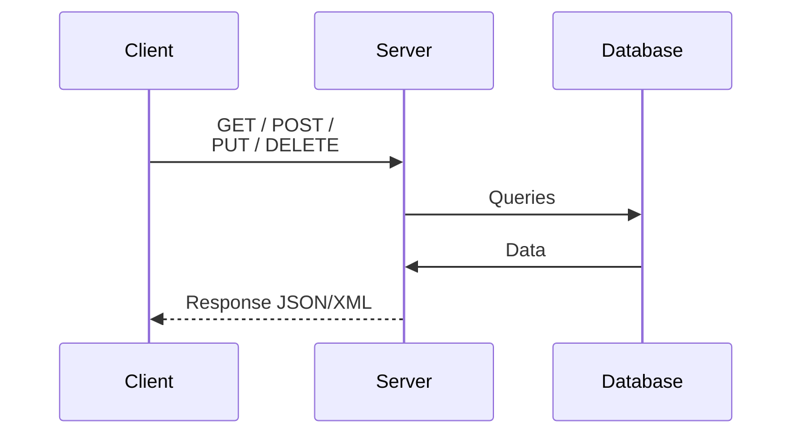
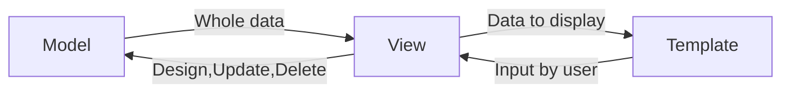

# API e salvataggio dati

Durante la progettazione dell'architettura del progetto si sono valutate diverse soluzioni per
il salvataggio dei dati in diversi linguaggi di programmazione. Alla fine si è deciso di
utilizzare Python con il suo framework Django.

Django è stato scelto per diverse motivi:

- Semplicità d'uso
- Fornisce un ORM, che semplifica il salvataggio dei dati in un database di tipo relazionale
- Interfaccia admin, dove si può interagire con il database in maniera semplice e intuitiva da
  parte dell'amministrazione del progetto
- Uso del routing molto semplice
- Scalabilità

Infine, ci siamo posti il problema di come un'applicazione esterna potesse ottenere i dati. Abbiamo
optato come metodo di comunicazione le API RESTful perché è il metodo che ci sembrava più
semplice da implementare. Fortunatamente, Django possiede un modulo (rest-framework) che ci
permetteva di implementare le API RESTFul in modo molto semplice. Ora spieghiamo prima cosa sono le REST API e poi
descriviamo ogni singola componente del Backend.

## API RESTful

Le API RESTful sono un'architettura software per la creazione di servizi web scalabili e interoperabili. Utilizzano
principi fondamentali di REST (Representational State Transfer) per la gestione delle risorse tramite operazioni HTTP
standard. Questo modello permette una comunicazione efficiente tra client e server, facilitando l'integrazione e la
manutenzione delle applicazioni distribuite.



### Caratteristiche Principali di un'API RESTful

L'architettura delle REST API è basata su risorse. Le risorse (es. utenti, prodotti) sono identificate
tramite URI (Uniform Resource Identifier) e manipolate tramite metodi standard `HTTP` (`GET`, `POST`, `PUT`, `DELETE`).

Questo tipo di architettura ha alcuni principi che deve rispettare:

- **Stateless**: Ogni richiesta da parte del client al server deve contenere tutte le informazioni necessarie per
  comprendere e processare la richiesta. Il server non mantiene lo stato della sessione tra le richieste.
- **Interfaccia uniforme**: Utilizza un insieme comune di operazioni (HTTP methods), formati di rappresentazione dei
  dati (JSON, XML) e URI per accedere e manipolare le risorse.
- **Layered System**: Il sistema può essere scalato dividendo funzionalità tra più livelli, migliorando la sicurezza e
  la scalabilità.
- **Cacheable**: Le risposte devono indicare se possono essere memorizzate in cache o meno per migliorare le
  prestazioni.

### Motivazioni per la Scelta di RESTful API

Le API RESTful sono preferite per diverse ragioni:

- **Semplicità e Facilità d'Uso**: Utilizzano metodi HTTP standard e formati di dati comuni, rendendo la comprensione e
  l'implementazione più accessibili.
- **Scalabilità e Affidabilità**: L'architettura basata su risorse e l'approccio stateless facilitano la scalabilità
  orizzontale e la gestione dei carichi di lavoro.
- **Interoperabilità**: Essendo basate su protocolli standard come HTTP, le API RESTful possono essere facilmente
  integrate con diverse piattaforme e dispositivi.
- **Mantenimento**: La separazione delle preoccupazioni e l'interfaccia uniforme semplificano il mantenimento e l'
  aggiornamento delle API nel tempo.

### Documentazione e Visualizzazione degli Endpoint

Per visualizzare gli endpoint delle API abbiamo utilizzato Swagger. Grazie a Swagger, disponiamo di un'interfaccia web
interattiva che permette di esplorare gli endpoint. Questa interfaccia è accessibile al seguente link:

`https:\\localhost:8000\swagger\`

c'è la possibilità di visualizzare gli endpoint anche tramite Redoc:

`https:\\localhost:8000\redoc\`

Questi endpoint rispettano i principi di un'API RESTful, consentendo operazioni CRUD (Create, Read, Update, Delete) su
risorse specifiche attraverso HTTP.

## Django e rest-framework

### Django

Django è un framework web robusto e versatile sviluppato in Python che consente di costruire applicazioni web sicure,
scalabili e mantenibili in modo efficiente. La sua architettura, l'ORM integrato e le numerose funzionalità
out-of-the-box ne fanno una scelta eccellente per progetti di qualsiasi dimensione.

#### Caratteristiche Tecniche Principali di Django

##### Architettura MTV (Model-Template-View):

Django utilizza un'architettura denominata MTV (Model-Template-View), che è una variante del MVC comune in molti
framework. Le diverse parti si occupano di diverse responsabilità all'interno dell'applicazione.

###### Il Model

Il model rappresenta la struttura del database e gestisce la logica di accesso ai dati tramite l'ORM (Object-Relational
Mapping) di Django. I vari model vengono definiti nel file `model.py`.

###### Template

Gestisce la presentazione dei dati attraverso un motore di template per generare il file HTML dinamico. Il motore di
template può essere quello integrato in Django oppure Ninja2.

###### View

Contiene la logica di business e coordina l'interazione tra i modelli e i template. Le viste ricevono le richieste HTTP,
elaborano i dati (spesso interagendo con i modelli) e restituiscono una risposta HTTP, spesso utilizzando un template
per generare la risposta. Le varie view sono definite all'interno del file `view.py`.



##### ORM (Object-Relational Mapping)

Un'ORM è uno strumento di programmazione che permette di interagire con un database relazionale utilizzando la
programmazione orientata agli oggetti. Questo approccio ha diversi vantaggi:

- Superamento dell'incompatibilità tra il progetto OOP e il modello relazionale
- Elevata portabilità rispetto alla tecnologia DBMS utilizzata
- Drastica riduzione della quantità di codice sorgente da redigere; l'ORM maschera dietro semplici comandi le complesse
  attività di creazione, prelievo, aggiornamento ed eliminazione dei dati (dette __CRUD__ - Create, Read, Update,
  Delete).
- Suggerisce la realizzazione dell'architettura di un sistema software mediante approccio stratificato, tendendo
  pertanto a isolare in un solo livello la logica di persistenza dei dati, a vantaggio della modularità complessiva del
  sistema.

Gli ORM implementano nativamente funzionalità che altrimenti andrebbero realizzate dal programmatore:

- Caricamento automatico del grafo degli oggetti secondo i legami di associazione definiti a livello di linguaggio. Il
  caricamento di un'ipotetica istanza della classe Studente, potrebbe automaticamente produrre il caricamento dei dati
  collegati sugli esami sostenuti. Tale caricamento, in più, può avvenire solo se il dato è effettivamente richiesto dal
  programma, ed è altrimenti evitato (tecnica nota con il nome di _lazy-initialization_).
- Gestione della concorrenza nell'accesso ai dati durante conversazioni. Conflitti durante la modifica di un dato da
  parte di più utenti in contemporanea, possono essere automaticamente rilevati dal sistema ORM.
- Meccanismi di caching dei dati.
- Gestione di una conversazione mediante uso del design pattern _Unit of Work_, che ritarda tutte le azioni di
  aggiornamento dei dati al momento della chiusura della conversazione; in questo modo le richieste inviate al RDBMS
  sono quelle strettamente indispensabili

##### Admin Interface

Una delle caratteristiche più apprezzate di Django è la sua interfaccia amministrativa auto-generata, che consente la
gestione dei dati del sito tramite un'interfaccia web user-friendly.

Noi abbiamo utilizzato questa interfaccia web per creare la pagina dove i dipendenti della nostra azienda possono
interagire con i dati ed eseguire il lavoro di valutazione delle auto usate e di inserimento di modelli auto,
optional e concessionari, in più possono visualizzare gli ordini e filtrare per sede.

##### Routing URL

Il sistema di routing di Django mappa gli URL alle funzioni di vista, permettendo una gestione chiara e strutturata
delle route dell'applicazione.

##### Sicurezza Integrata

Django viene fornito con una serie di protezioni contro attacchi comuni come XSS (Cross-Site Scripting), CSRF (
Cross-Site Request Forgery), SQL injection e clickjacking. Include anche un sistema di gestione delle password sicuro.

##### Scalabilità e Prestazioni

Django è progettato per essere altamente scalabile, utilizzato in grandi applicazioni web come Instagram e Pinterest.
Supporta tecniche di caching e integrazione con sistemi di front-end distribuiti per migliorare le prestazioni.

##### Middleware

Django include middleware che possono essere usati per elaborare richieste e risposte, gestire sessioni, autenticazione
e altre funzioni essenziali del web.

### Django-rest-framework (DRF)

Django REST Framework (DRF) è un potente toolkit per costruire API Web in Django. Fornisce un insieme di
strumenti e funzionalità che facilitano lo sviluppo di API RESTful, mantenendo la coerenza con i principi del framework
Django.

[//]: # (todo: aggiungere un grafico dell'architettura di DRF)

#### Caratteristiche principali

Le caratteristiche principali che il DRF implementa sono:

1. Serializzatori
2. Viewsets
3. Router

Tutti questi componenti li si possono trovare nella cartella `Backend_IngSoft/api`.

##### Serializzatori

I serializers in DRF trasformano i dati complessi come querysets e modelli Django in formati JSON, XML, e altri formati
di contenuto. Inoltre, possono convalidare i dati in ingresso e deserializzarli per convertirli in tipi di dati
complessi utilizzabili in Python. Possiedono dei metodi che vanno bene per la maggior parte degli usi però c'è la
possibilità di fare override di quei metodi per customizzare i body delle request.

```python
from rest_framework import serializers
from Backend.Backend_IngSoft.models import Utente


class UtenteSerializer(serializers.ModelSerializer):
    class Meta:
        model = Utente
        fields = '__all__'
```

##### Viewsets

Le viewsets sono componenti che aggregano la logica comune per una serie di viste correlate, semplificando
l'implementazione delle operazioni CRUD per i modelli Django. Raggruppa un insieme di metodi per gestire le varie
operazioni HTTP come `GET`, `POST`, `PUT` e `DELETE`.

I metodi più comuni delle viewsets sono:

- list
- retrieve
- create
- update
- partial_update
- destroy

```python
from rest_framework.views import APIView


class UtenteView(APIView):
    def get(self, request):
        ...

    def post(self, request):
        ...

    def put(self, request):
        ...

    def delete(self, request):
        ...
```

##### Router

I router mappano automaticamente i metodi HTTP alle azioni appropriate delle viewsets, rendondo la definizione delle
route più semplice.

```python
from django.urls import path
from Backend.Backend_IngSoft.api.views import UtenteListCreateAPIView

urlpatterns = [
    ...,
    path('utenti', UtenteListCreateAPIView.as_view())
]
```