# Use case Diagram

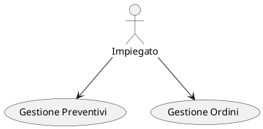

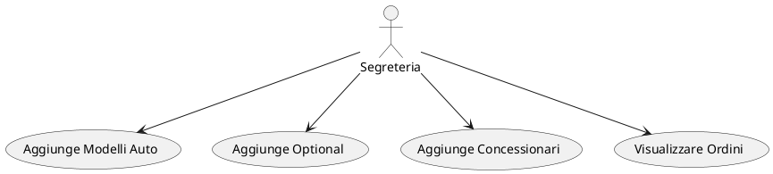

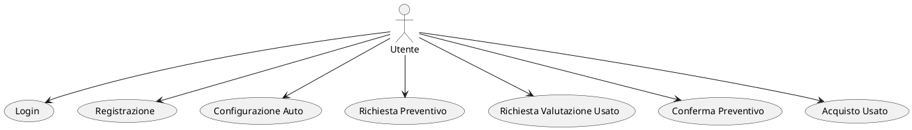

## Sequence Diagram

### Login

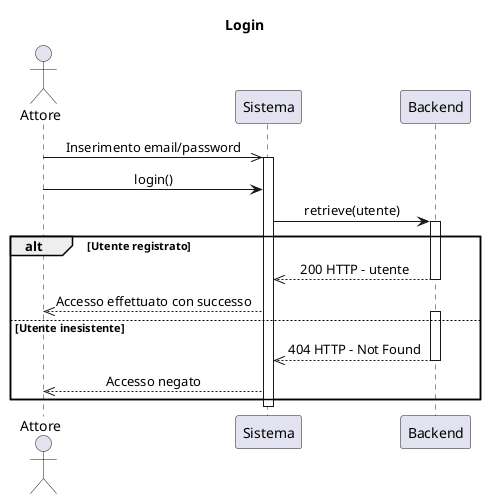

### Registrazione

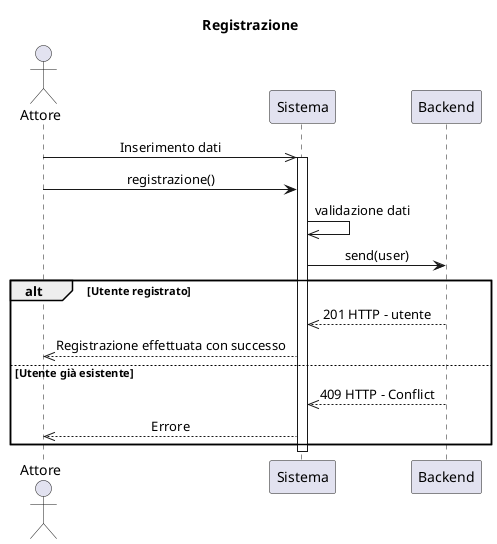

### Configurazione

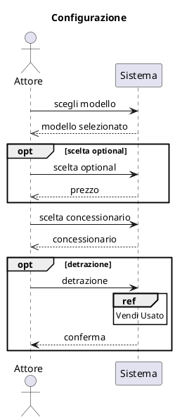

### Preventivo

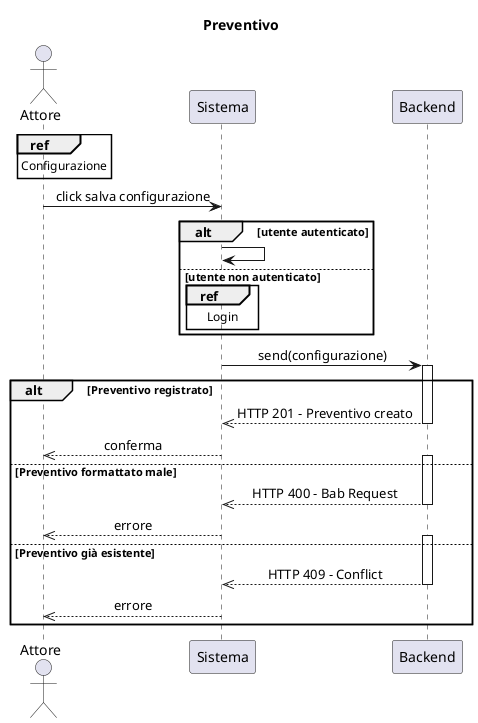

### Vendi Usato

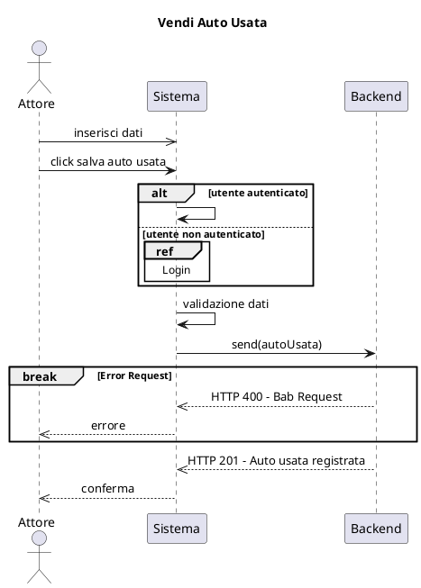

### Conferma Preventivo

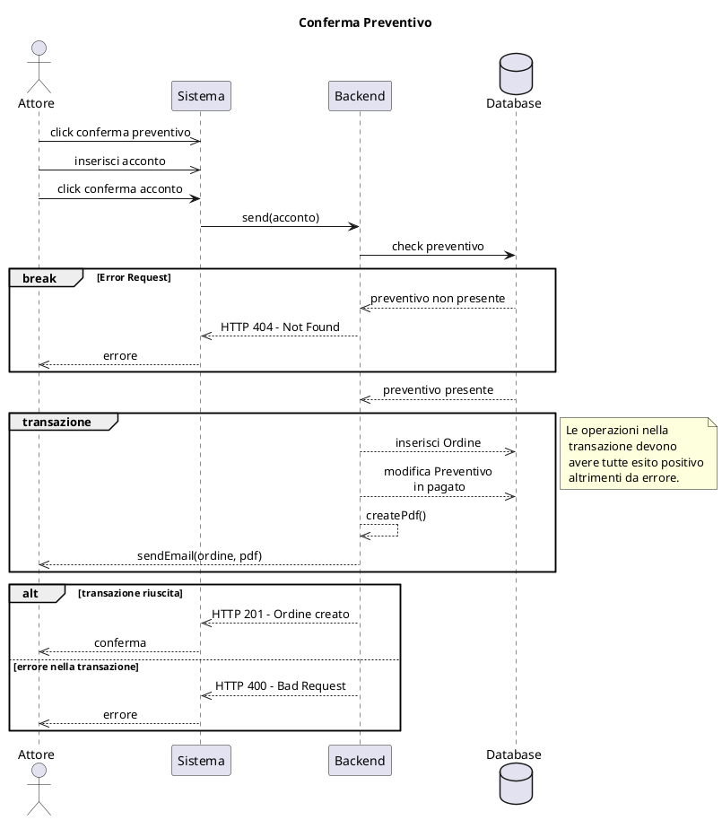

### Acquista Auto Usata

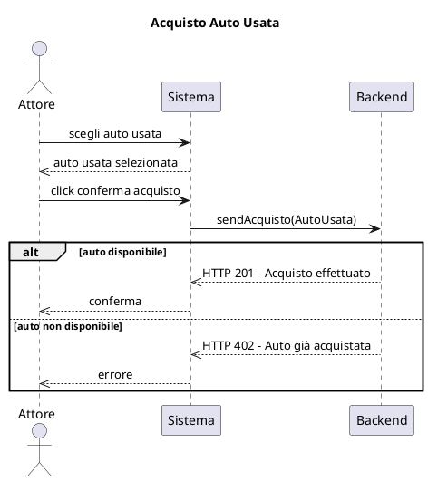

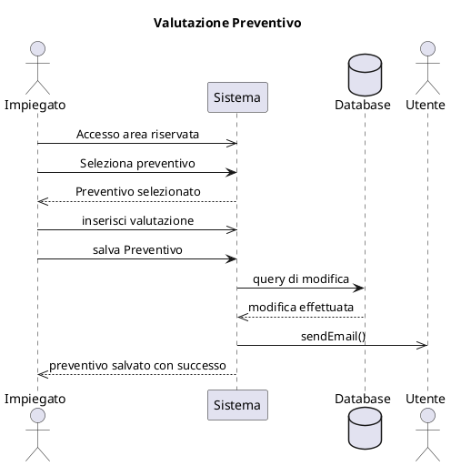

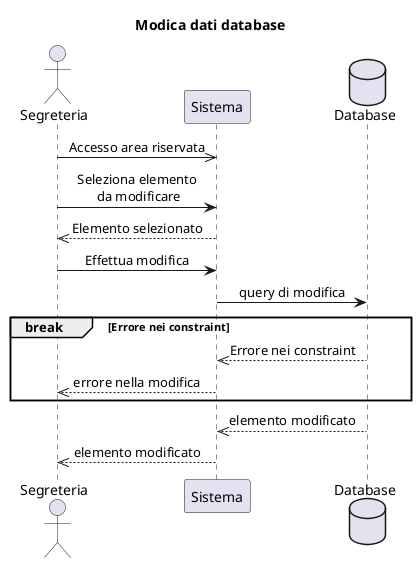

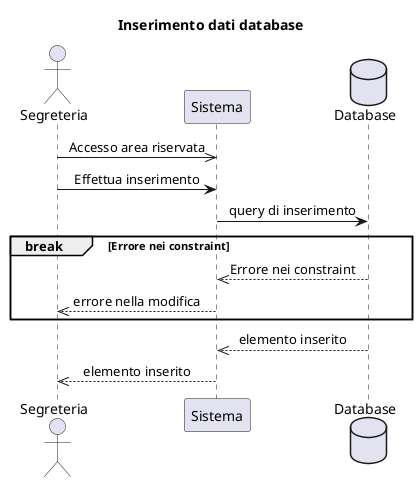

## Diagramma di Attività

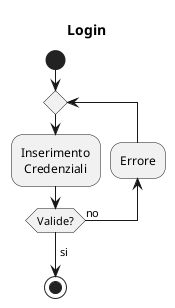

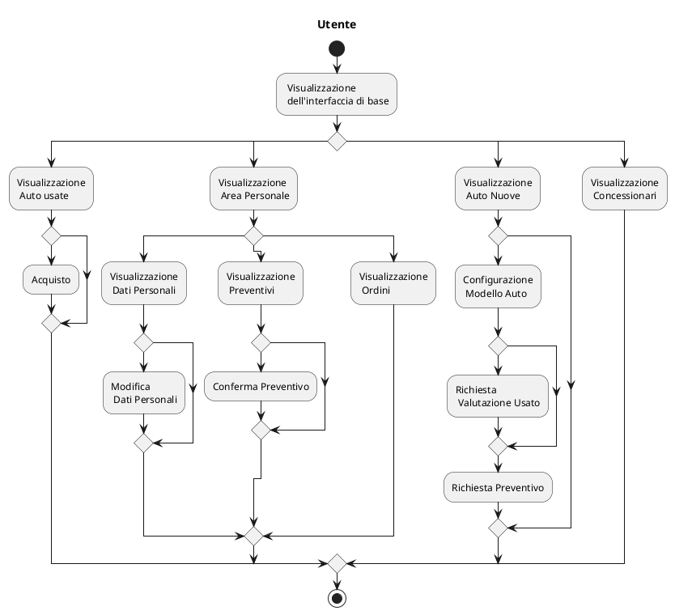

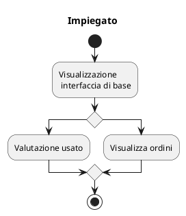

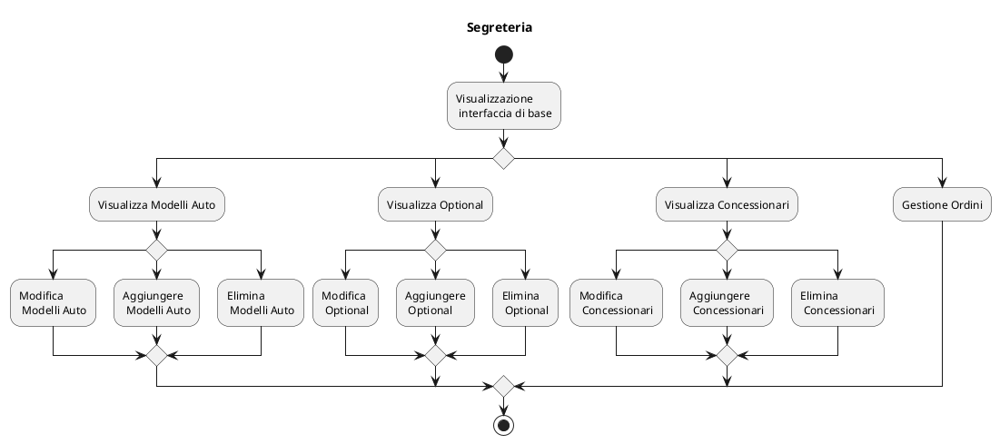

## Processo di sviluppo

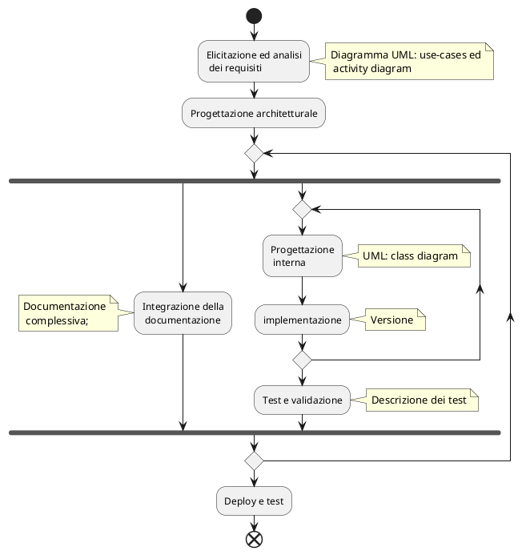