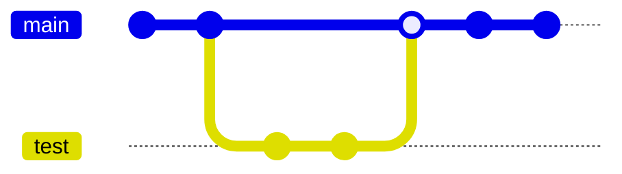

# Versioning del progetto

Durante lo sviluppo del progetto si è utilizzato git per tenere traccia delle modifiche che venivano apportate. Per
poter lavorare in gruppo, il progetto è stato caricato su GitHub al
seguente [link](https://github.com/Sir-Vlad/JavaFX-SoftIng.git).

Durante lo sviluppo si è utilizzata una pratica molto comune nel ciclo di sviluppo del software quella di avere due
branch: uno di main e uno di test. Il branch di `main` rappresenta il ramo principale del progetto ed è destinato ad
avere la versione stabile del progetto mentre il branche di test è utilizzato per implementare nuove funzionalità oppure
risolvere bug prima di integrarle nel branch principale.

Durante lo sviluppo del software, abbiamo creato un nuovo branch partendo dal main. Una volta completate le modifiche si
apre una pull request verso il branch `main`. Questo permette agli altri membri del progetto di revisionare il
codice, discutere dell'implementazione ed eseguire i test di integrazione.

Dopo che pull è stata approvata, si può passare all'integrazione nel branch principale tramite `merge`. Nel caso
compaiono dei conflitti, quest'ultimi vengono risolti e infine eseguita la `merge`.

