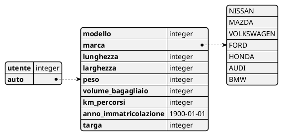
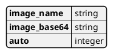
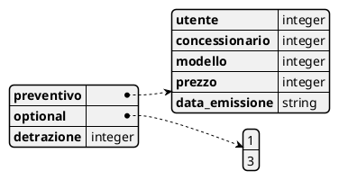
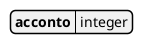
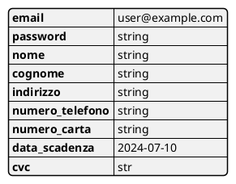

# json

**`POST /autoUsate/`**

 
**`POST /immaginiAutoUsate/<id_auto>/`**

**`POST /utente/<id_utente>/preventivi/`**

**`POST /utente/<id_utente>/preventivo/<id_preventivo>/conferma/`**

 
**`POST /utenti/`**

